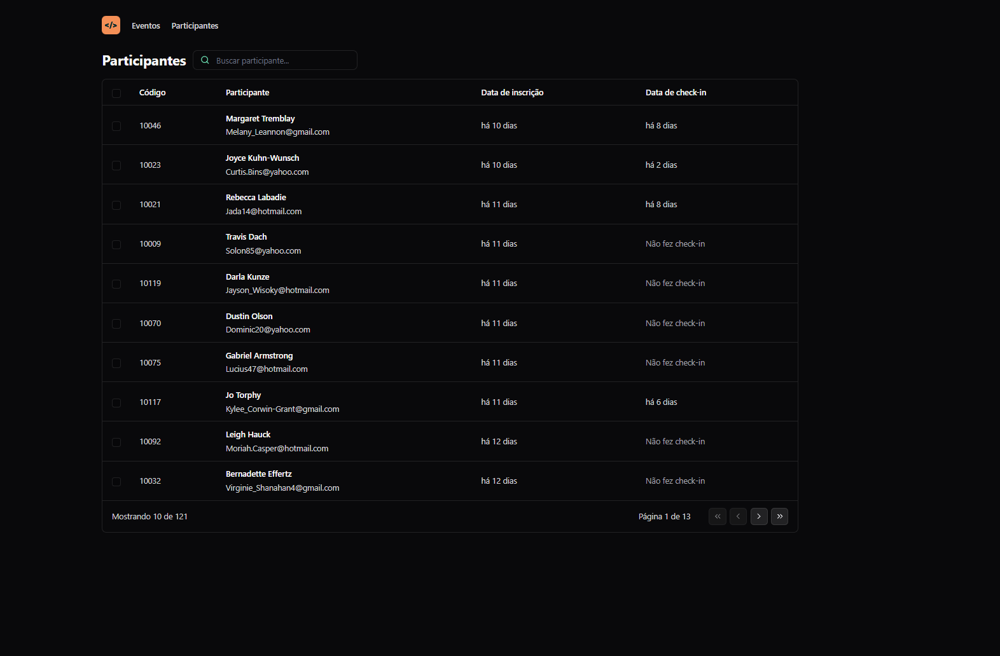
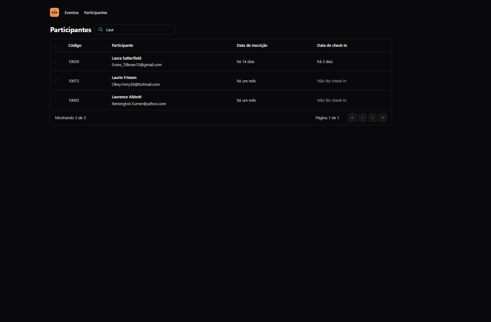

# Pass In

## Application to manage attendees check-ins on a event

> The project aimed to improve knowledge about app states, url states, native APIs and backend integration, using React+Vite, TypeScript and Tailwind to build it.

🔗 [Click here to access](https://matheusborgesdev.github.io/pass-in)

## 💻 Technologies

- React+Vite
- TypeScript
- Tailwind

## 📧 Contact

matheusb.dev@gmail.com